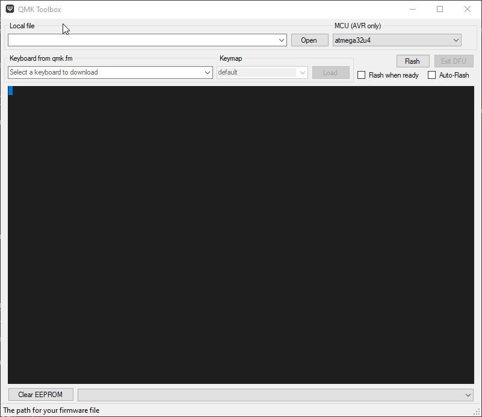
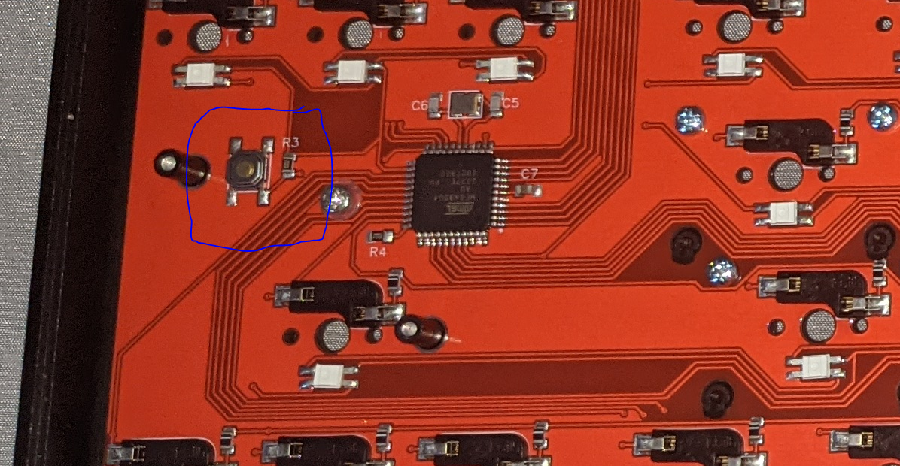
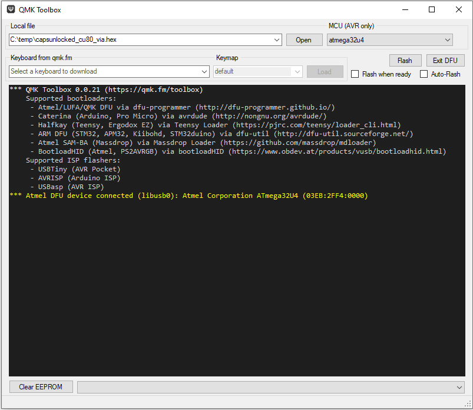
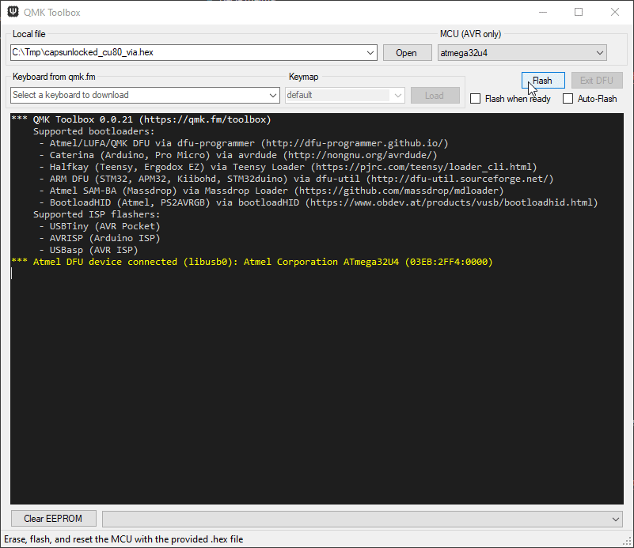
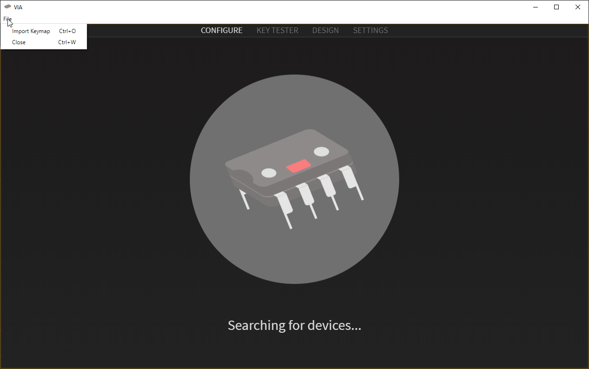
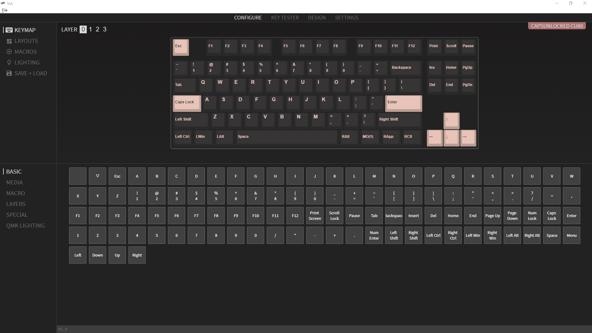
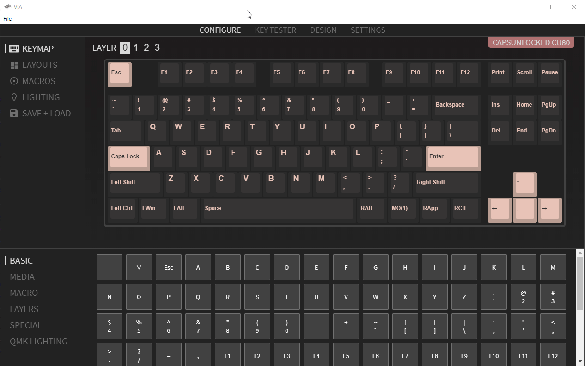
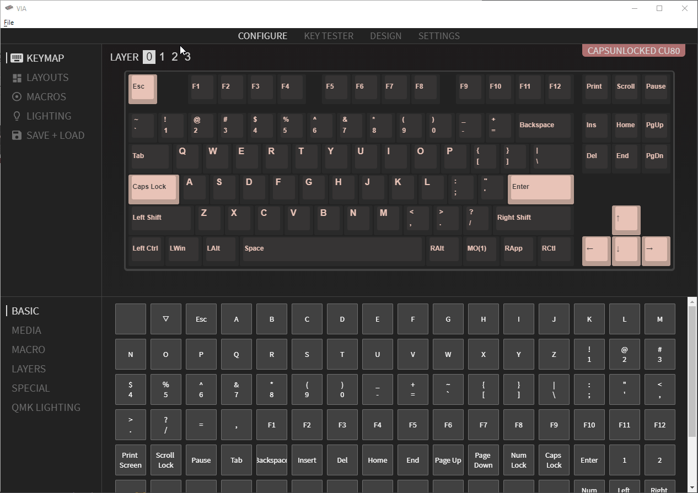

  * [Important notes](#important-notes)
  * [Flashing Requirements](#flashing-requirements)
  * [Getting ready to flash](#getting-ready-to-flash)
  * [Configuration using VIA](#configuration-using-via)

# Capsunlocked CU80 firmware flashing guide

Quick guide on flashing your stock CU80 (v2 PCB) to a newer firmware version.

This is a reference/guide to help fellow CU80 owners flash firmware and/or recover from a bad flash.

## Important notes

- VIA firmware is built to support both ANSI and ISO with a single unified .hex.
  - This allows you to switch layouts dynamically without flashing new firmware for each change.

- QMK firmware as shipped with Round 2 boards and custom built firmware through the 
  - This allows for little to no modifications outside changing the LED lighting.

- QMK Configurator is targeted to a specific board layout so ensure you use the correct file when flashing.
  - This can be configured to an extent by the end user, and is baked into a new firmware .hex, this type of firmware should be considered "untested" until you flash it and confirm its working yourself.

## Flashing Requirements

### [QMK Toolbox](https://github.com/qmk/qmk_toolbox/releases/latest)
The QMK Toolbox is designed to make flashing firmware simple the only real thing to watch out for is the "device not found" error which can be fixed using [Zadig as detailed in the QMK documentation](https://docs.qmk.fm/#/driver_installation_zadig)

### A valid .hex file for your keyboard

- VIA compatible .hex files can be found here [caniusevia](https://caniusevia.com/docs/download_firmware/)
- .hex files from [qmk.fm](https://qmk.fm)
- .hex file(s) will also be posted in the #latest-firmware channel on the [Capsunlocked discord server](https://discord.com/invite/c6Eytwc).
- .hex file(s) created using QMK Configurator. [*Please note that the online configurator has a cu80 listed, this is the V1 board firmware and is **not** compatible with the V2 board. Please wait for official support for the capsunlocked/cu80 before using the configurator*]

In all cases you should also have a working .hex to use as a "roll back". 

#### Test Binaries - temporary

To simplify this I've included links to the Test Binaries posted on 2021-02-04 by the maintainer.
This is a build of the firmware directly from the maintainers branch compiled by him while he awaits acceptance of the official firmware merger into QMK and VIA master branches.

These files are TEST firmware, they have been tested by several community members and are functional for both ISO and ANSI keymaps.

**RIGHT CLICK SAVE AS!!**

|Firmware Type |Layout|Link|
|:---|:---|:---|
|QMK|ANSI| [QMK ANSI](https://github.com/maz0r/cu80-flashguide/raw/main/test_binaries/QMK/capsunlocked_cu80_v2_ansi_default.hex) |
|VIA|ANSI| [VIA ANSI](https://github.com/maz0r/cu80-flashguide/raw/main/test_binaries/VIA/capsunlocked_cu80_v2_ansi_via.hex) & [ANSI Sideload](https://github.com/maz0r/cu80-flashguide/raw/main/test_binaries/VIA/cu80_v2_ansi.json) |
|QMK|ISO| [QMK ISO](https://github.com/maz0r/cu80-flashguide/raw/main/test_binaries/QMK/capsunlocked_cu80_v2_iso_default.hex) |
|VIA|ISO| [VIA ISO](https://github.com/maz0r/cu80-flashguide/raw/main/test_binaries/VIA/capsunlocked_cu80_v2_iso_via.hex) & [ANSI Sideload](https://github.com/maz0r/cu80-flashguide/raw/main/test_binaries/VIA/cu80_v2_iso.json) |

Layouts

  

For sideloading into VIA see [sideloading in via](#sideloading-in-via)

## Getting ready to flash

Connect your keyboard
Launch QMK Toolbox

##### Select firmware to flash

In QMK Toolbox select Open & navigate to your .hex file and click open

##### Enter DFU (device firmware upgrade) mode

This mode will persist until firmware is flashed or keyboard power is cycled unless no firmware is present.

###### Stock firmware

 - If the keyboard is functional  
    - FN + DELETE will reboot into DFU mode
 - If the keyboard is not functional use the [Hardware Reset](#hardware-reset)

###### VIA Firmware

 - If the keyboard is functional
   - FN + ESC will reboot into DFU mode
 - If not use the [Bootmagic](#bootmagic-firmware) method

###### Bootmagic Firmware

 - Disconnect the USB from the keyboard
 - Reconnect the USB cable while holding ESC on the keyboard

###### Hardware Reset

 - Remove the backplate
 - Plug in the keyboard
 - Press the physical reset button on the back of the PCB

##### Verify you are in Bootloader Mode

If you have successfully entered bootloader mode, the keyboard should disconnect and reconnect (you may hear a sound in windows) 

Shortly after re-connecting you should see a yellow line appear in your QMK Toolbox window as per the below image.

If you have a different message check out the [Zadig](https://docs.qmk.fm/#/driver_installation_zadig) troubleshooting steps on the QMK site.

**for MacOS users you may have to tick the "Auto Flash Firmware" button for the device to be detected by QMK Toolkit!**

#### Flash the firmware

Click flash!

On completion the keyboard should disconnect and begin <u>functioning</u> as per its new firmware.

## Configuration using VIA

### Setup
- Download [VIA](https://github.com/the-via/releases/releases/latest)

- Launch VIA
  

If your keyboard is not automatically detected it can caused by several factors

1. You do not have a VIA compatible firmware flashed
2. The version of the VIA app you are using does not include the keymap for your board it may take a little while for the board to be added to the software. See [sideloading in via](#sideloading-in-via).
3. You are still in bootloader mode
  - You would not be able to type if that was the case.

### Sideloading in VIA

A CU80v2.json file is avaliable for sideloading into alongside VIA firmware while native support is pending.
This can be found in Discord along with a VIA .hex file *if you cannot find it DM maz#1529 and I'll send you a copy when I see your message*

### Basic VIA Configuration (like real basic)

*Things may be appear differently for you as this is from a test firmware/keymap*

Once your keyboard has been detected in VIA, you should be presented with the following screen.

From here you can edit most functions of the keyboard from creating macros to rebinding layers, and switch between ANSI/ISO layouts.

###### Switching between ANSI/ISO layouts

###### Remapping a Key

###### Editing Layers

