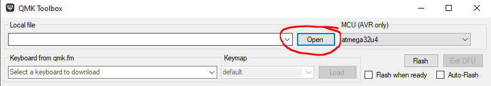
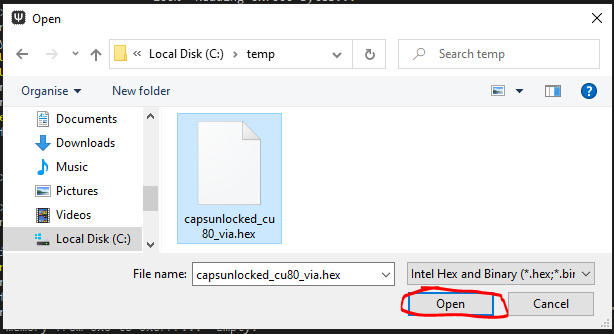
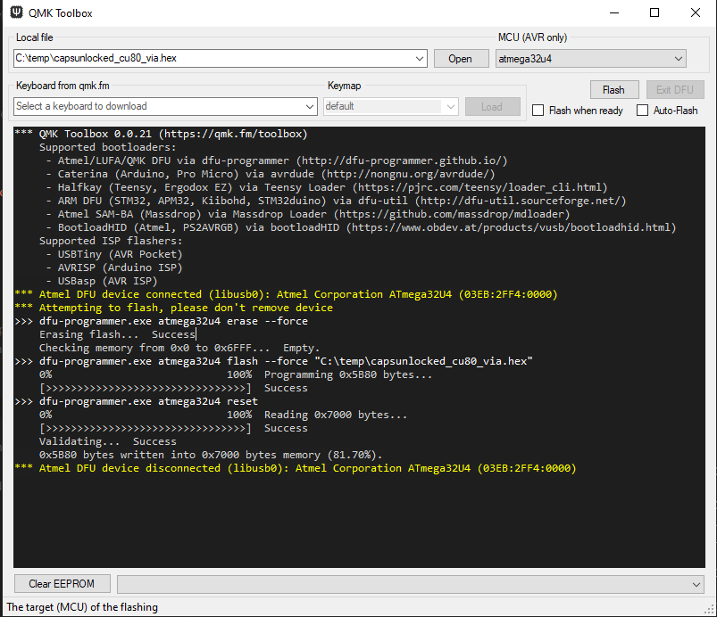

[TOC]

# Capsunlocked CU80 firmware flashing guide

Quick guide on flashing your stock CU80 (v2 PCB) to a newer firmware version.

This is a reference/guide to help fellow CU80 owners flash firmware and/or recover from a bad flash.

## Important notes

- VIA firmware is built to support both ANSI and ISO with a single unified .hex.
  - This allows you to switch layouts dynamically without flashing new firmware for each change.

- QMK firmware as shipped with Round 2 boards and custom built firmware through the 
  - This allows for little to no modifications outside changing the LED lighting.

- QMK Configurator is targeted to a specific board layout so ensure you use the correct file when flashing.
  - This can be configured to an extent by the end user, and is baked into a new firmware .hex, this type of firmware should be considered "untested" until you flash it and confirm its working yourself.

## Flashing Requirement(s)

### [QMK Toolkit](https://github.com/qmk/qmk_toolbox/releases/latest)
The QMK Toolkit is designed to make flashing firmware simple the only real thing to watch out for is the "device not found" error which can be fixed using [Zadig as detaiiled in the QMK documentation](https://docs.qmk.fm/#/driver_installation_zadig)

### A valid .hex file for your keyboard

- VIA compatible .hex files can be found here [caniusevia](https://caniusevia.com/docs/download_firmware/)
- .hex files from [qmk.fm](https://qmk.fm)
 - .hex file(s) will also be posted in the #latest-firmware channel on the [Capsunlocked discord server](https://discord.com/invite/c6Eytwc).
 - A .hex file created using QMK Configurator, you should also have a working .hex to use as a "roll back".

## Getting ready to flash

Connect your keyboard

Launch QMK Toolbox

##### Select firmware to flash

​	In QMK Toolbox select Open & navigate to your .hex file

​	hit open
​					

##### Enter DFU (device firmware upgrade) mode

This mode will persist until firmware is flashed or keyboard power is cycled.

###### Stock firmware

 - If the keyboard is functional 
   
    - FN + DELETE will reboot into DFU mode
    
- If the keyboard is not functional use the [Hardware Reset](#hardware-reset)

    

###### VIA Firmware

- If the keyboard is functional

  - FN + ESC will reboot into DFU mode

- If not use the [Bootmagic](#bootmagic-firmware) method

  

###### Bootmagic Firmware

- Disconnect the USB from the keyboard
- Reconnect the USB cable while holding ESC on the keyboard
  

###### Hardware Reset

 - Remove the backplate

 - Plug in the keyboard

 - Press the physical reset button on the back of the PCB

   

##### Verify you are in Bootloader Mode

If you have successfully entered bootloader mode, the keyboard should disconnect and reconnect (you may hear a sound in windows) 

Shortly after re-connecting you should see a yellow line appear in your QMK Toolbox window as per the below image.

If you have a different message check out the [Zadig](https://docs.qmk.fm/#/driver_installation_zadig) troubleshooting steps on the QMK site.

#### Flash the firmware

​	Click flash!

​	On completion the keyboard should disconnect and begin <u>functioning</u> as per its new firmware.

## Configuration using VIA

### Setup
- Download [VIA](https://github.com/the-via/releases/releases/latest)

- Launch VIA

   

   If your keyboard is not automatically detected it can caused by several factors

       	1. You do not have a VIA compatible firmware flashed
      2. The version of VIA you are using does not have the keymap for your keyboard you should update (or) wait for support
         - It is possible to sideload a keyboard/keymap if it is not recognised by VIA but has a valid firmware, but that's outside the scope of this guide.

   3. You are still in bootloader mode 
      - You would not be able to type if that was the case.

### Basic VIA Configuration (like real basic)

*Things may be appear differently for you as this is from a test firmware/keymap*

	Once your keyboard has been detected in VIA, you should be presented with the following screen.

From here you can edit most functions of the keyboard from creating macros to rebinding layers, and switch between ANSI/ISO layouts.

###### Switching between ANSI/ISO layouts

###### Remapping a Key

###### Editing Layers

